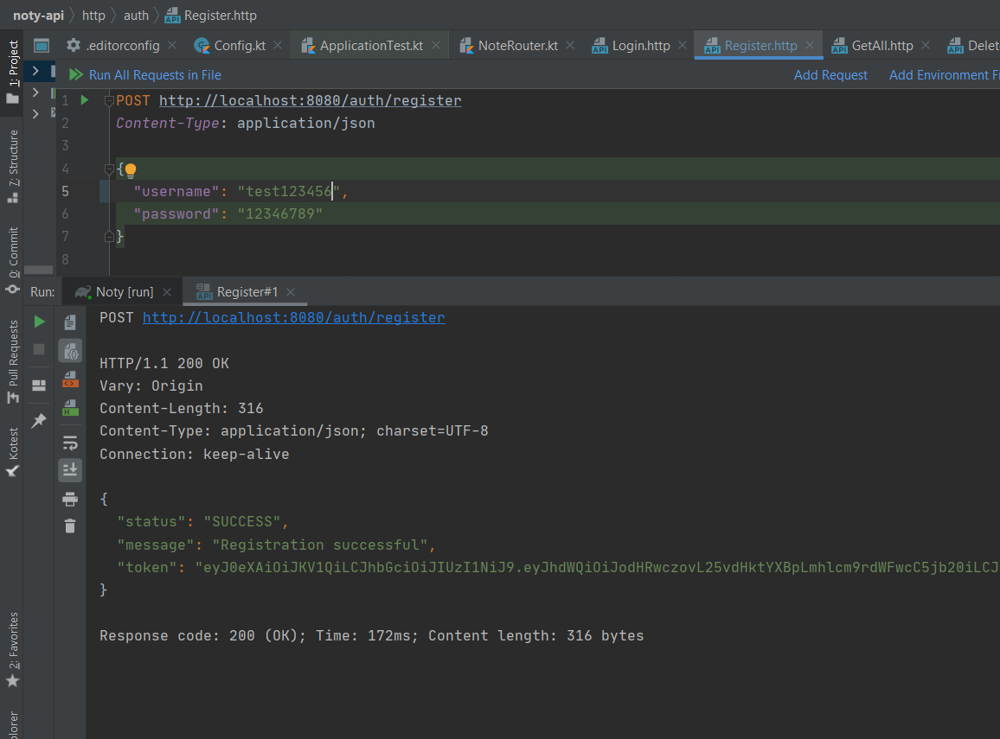

# 🖥 Development Setup

Follow these steps to set up NotyKT API project locally.

## 🗄️ Database Setup

- Download and install the latest [PostgreSQL package](https://www.postgresql.org/download/) as per your system need.

- After successful installation, create database for this project.  
For e.g. create database named `notykt_dev_db`.

_After setting up database, you can proceed to set up project._

## ⚙️ Project Setup

You will require latest stable version of JetBrains IntelliJ Idea IDE to build and run the server application. You can install the latest version from [here](https://www.jetbrains.com/idea/).

- Import project in IntelliJ IDE.

- Use existing Gradle wrapper for syncing project.

- Build 🔨 the project.

- Set up environment variables for database credentials as following with valid values as per your setup.

```
SECRET_KEY=ANY_RANDOM_SECRET_VALUE

PGPORT=5432
PGHOST=localhost
PGDATABASE=notykt_dev_db
PGUSER=postgres
PGPASSWORD=postgres

DATABASE_DRIVER=org.postgresql.ds.PGSimpleDataSource
DATABASE_MAX_POOL_SIZE=10
```

?> These environment variables are used from [`application.conf`](https://github.com/PatilShreyas/NotyKT/blob/master/noty-api/application/resources/application.conf) and then retrieved in [`Config.kt`](https://github.com/PatilShreyas/NotyKT/blob/master/noty-api/application/src/dev/shreyaspatil/noty/api/Config.kt).

- Finally, execute command `gradlew :application:run` _**or**_ use IntelliJ's run configuration to run the API server application. You can see console output like...


- Hit `http://localhost:8080` and API will be live🔥.

- You can find [sample HTTP requests](https://github.com/PatilShreyas/NotyKT/blob/master/noty-api/http) in `/http` directory and can directly send requests from IntelliJ itself.

_For example, there's sample request for user registration in `/http/auth` and we can execute and see response from IntelliJ itself as in below image._  



## 🧪 Running Application Tests

Tests for the application are written in [`ApplicationTest.kt`](https://github.com/PatilShreyas/NotyKT/blob/master/noty-api/application/test/dev/shreyaspatil/noty/api/ApplicationTest.kt) which uses Ktor's test framework for server.  

It uses [Testcontainers](https://www.testcontainers.org/) to interact with test database which is only created temporarily for testing purpose and destroyed once tests are completed which reduces overhead of managing separate database for testing.

?> **Testcontainers** uses Docker internally so you'll need to install and setup [_**Docker**_](https://www.docker.com/) on your machine to be able to run the tests.
